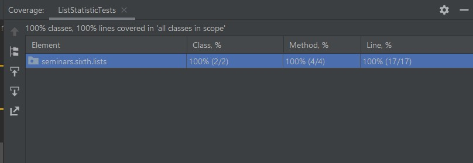
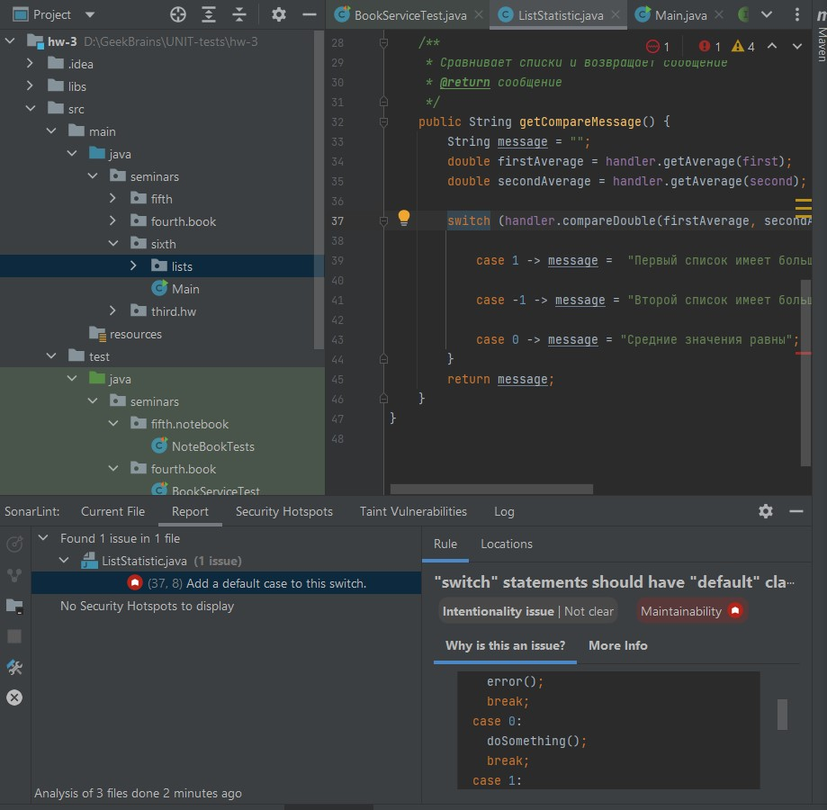
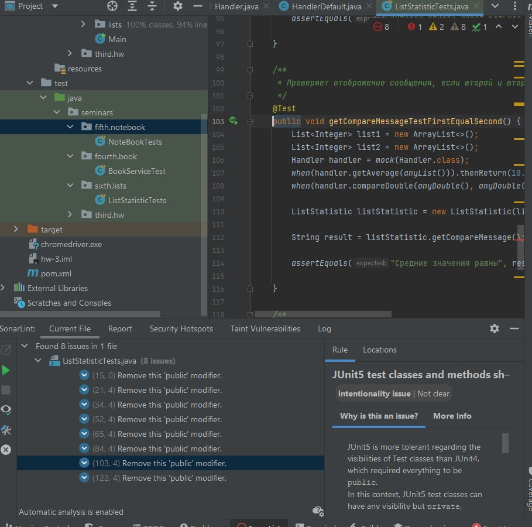

 ## Урок 6. Юнит тестирование в других языках

 **Задание 1.** 
 
 Создайте программу на Python или Java, которая принимает два списка чисел и выполняет следующие действия:
a. Рассчитывает среднее значение каждого списка.
b. Сравнивает эти средние значения и выводит соответствующее сообщение:

- "Первый список имеет большее среднее значение", если среднее значение первого списка больше.

- "Второй список имеет большее среднее значение", если среднее значение второго списка больше.

- "Средние значения равны", если средние значения списков равны.

**Важно:**

Приложение должно быть написано в соответствии с принципами объектно-ориентированного программирования. 
Используйте Pytest (для Python) или JUnit (для Java) для написания тестов, которые проверяют правильность работы программы. Тесты должны учитывать различные сценарии использования вашего приложения.
Используйте pylint (для Python) или Checkstyle (для Java) для проверки качества кода.

Сгенерируйте отчет о покрытии кода тестами. Ваша цель - достичь минимум 90% покрытия.

**Формат и требования к сдаче:** 

Отчет о выполнении этого задания должен включать в себя следующие элементы:
- Код программы
- Код тестов
- Отчет pylint/Checkstyle
- Отчет о покрытии тестами
- Объяснение того, какие сценарии покрыты тестами и почему вы выбрали именно эти сценарии.

### Решение.

- Для написания тестов использовались JUnit, Mockito. 

- Для контроля качества кода использовался плагин SonarLint

Тестовые методы `handlerGetAverageCorrect`, `handlerGetAverageSingle`, `handlerCompairDoubleTest` это юнит тесты, проверяющие правильность работы методов работы экземпляра класса `HandlerDefault`.

Класс `ListStatistic` имеет зависимость в виде переменной типа `Handler`, поэтому в методах `getCompareMessageTestSecondBigger`, `getCompareMessageTestFirstBigger`, `getCompareMessageTestFirstEqualSecond` используются mock-объекты, подменяющие `Handler`.

Тестовый метод `getCompareMessageTest` - это сквозной тест, использующий реальные объекты для теста и реализующий вертикальный срез логики программы.

Отчёт о покрытии тестами:

Отчёты SonarLint:

